# Class Diagram - Home Assistant Device SDK

This diagram shows the complete inheritance hierarchy starting from `IEntity` and all classes, interfaces and types that derive from it.

```mermaid
classDiagram
    %% Base Entity Types
    class IEntityState {
        <<interface>>
        +readonly status: any
        +readonly lastChanged?: Date
        +readonly lastReported?: Date
        +readonly lastUpdated?: Date
    }

    class IEntity {
        <<interface>>
        +readonly TypeStatus: any
        +readonly state: any
        +readonly name: string
        +onStateChange(change: IChangedState~any~): void
        +removeOnStateChange(callback): void
    }

    class IChangedState~T~ {
        <<interface>>
        +readonly newState: T
        +readonly oldState: T
    }

    class ENTITY_STATUS {
        <<const>>
        +UNKNOWN: "unknown"
        +UNAVAILABLE: "unavailable"
    }

    %% Switchable Entity Types
    class ISwitchableState {
        <<interface>>
        +readonly status: ISwitchableStatus
    }

    class ISwitchableEntity {
        <<interface>>
        +readonly TypeStatus: typeof SWITCHABLE_STATUS
        +readonly state: any
        +turnOn(option?: any): Promise~boolean~
        +turnOff(): Promise~boolean~
        +toggle(option?: any): Promise~boolean~
        +onTurnOn(): void
        +onTurnOff(): void
        +removeOnTurnOn(callback): void
        +removeOnTurnOff(callback): void
    }

    class SWITCHABLE_STATUS {
        <<const>>
        +...ENTITY_STATUS
        +ON: "on"
        +OFF: "off"
    }

    class ISwitchableStatus {
        <<type>>
        TypeIn~typeof SWITCHABLE_STATUS~
    }

    %% Switch Types
    class ISwitchableSimple {
        <<interface>>
        +turnOn(): Promise~boolean~
        +toggle(): Promise~boolean~
        +onStateChange(change: IChangedState~ISwitchableState~): void
        +onTurnOn(): void
        +onTurnOff(): void
        +removeOnStateChange(callback): void
    }

    class ISwitch {
        <<interface>>
    }

    %% Light Base Types
    class ILight {
        <<interface>>
    }

    %% Light Feature Interfaces
    class ILightBrightnessFeature {
        <<interface>>
        +brightness?: number
    }

    class ILightTemperatureFeature {
        <<interface>>
        +temperature?: number
    }

    class ILightColorFeature {
        <<interface>>
        +colorRGB?: ColorRGB
        +colorName?: ColorNameEnum
    }

    class ILightTransitionFeature {
        <<interface>>
        +transition?: number
    }

    class ILightEffectFeature~EFFETS~ {
        <<interface>>
        +effect?: ValuesIn~EFFETS~
    }

    %% Light State Types
    class ILightBrightnessState {
        <<type>>
        ISwitchableState & ILightBrightnessFeature
    }

    class ILightTemperatureState {
        <<type>>
        ISwitchableState & ILightTemperatureFeature
    }

    class ILightColorState {
        <<type>>
        ISwitchableState & ILightColorFeature
    }

    class ILightTransitionEffectFeature~EFFETS~ {
        <<type>>
        ILightTransitionFeature & ILightEffectFeature~EFFETS~
    }

    %% Light Implementation Interfaces
    class ILightBrightness {
        <<interface>>
        +readonly state: ILightBrightnessState
        +brightness?: number
        +turnOn(option?: ILightBrightnessFeature): Promise~boolean~
        +toggle(option?: ILightBrightnessFeature): Promise~boolean~
        +onStateChange(change: IChangedState~ILightBrightnessState~): void
        +removeOnStateChange(callback): void
    }

    class ILightTemperatureBase {
        <<interface>>
        +readonly temperatureMax?: number
        +readonly temperatureMin?: number
        +brightness?: number
    }

    class ILightTemperature {
        <<interface>>
        +readonly state: ILightTemperatureState
        +turnOn(option?: ILightTemperatureFeature): Promise~boolean~
        +toggle(option?: ILightTemperatureFeature): Promise~boolean~
        +onStateChange(change: IChangedState~ILightTemperatureState~): void
        +removeOnStateChange(callback): void
    }

    class ILightColorBase {
        <<interface>>
        +readonly TypeColorName: typeof ColorNameEnum
        +readonly state: ILightColorState
        +colorRGB?: ColorRGB
        +colorName?: ColorNameEnum
        +onStateChange(change: IChangedState~ILightColorState~): void
        +removeOnStateChange(callback): void
    }

    class ILightColor {
        <<interface>>
        +turnOn(option?: ILightColorFeature): Promise~boolean~
        +toggle(option?: ILightColorFeature): Promise~boolean~
    }

    class IlightTransition {
        <<interface>>
        +transition?: number
        +turnOn(option?: ILightTransitionFeature): Promise~boolean~
        +toggle(option?: ILightTransitionFeature): Promise~boolean~
    }

    class IlightEffect~EFFETS~ {
        <<interface>>
        +readonly TypeEffets: EFFETS
        +effect?: ValuesIn~EFFETS~
        +turnOn(option?: ILightEffectFeature~EFFETS~): Promise~boolean~
        +toggle(option?: ILightEffectFeature~EFFETS~): Promise~boolean~
    }

    class IlightTransitionEffect~EFFETS~ {
        <<interface>>
        +readonly TypeEffets: EFFETS
        +effect?: ValuesIn~EFFETS~
        +transition?: number
        +turnOn(option?: ILightTransitionEffectFeature~EFFETS~): Promise~boolean~
        +toggle(option?: ILightTransitionEffectFeature~EFFETS~): Promise~boolean~
    }

    %% Supporting Types
    class ColorRGB {
        <<type>>
        r: number, g: number, b: number | [number, number, number]
    }

    class ColorNameEnum {
        <<enum>>
        +Homeassistant: "homeassistant"
        +Red: "red"
        +Blue: "blue"
        +Green: "green"
        +...150+ colors
    }

    %% Inheritance Relationships
    IEntityState <|-- ISwitchableState
    IEntity <|-- ISwitchableEntity
    ISwitchableEntity <|-- ISwitchableSimple
    ISwitchableSimple <|-- ISwitch
    ISwitchableSimple <|-- ILight

    %% Light Feature Inheritance
    ILightBrightnessFeature <|-- ILightTemperatureFeature
    ILightTemperatureFeature <|-- ILightColorFeature
    ILightColorFeature <|-- ILightTransitionFeature
    ILightColorFeature <|-- ILightEffectFeature

    %% Light Implementation Inheritance
    ISwitchableEntity <|-- ILightBrightness
    ISwitchableEntity <|-- ILightTemperatureBase
    ILightTemperatureBase <|-- ILightTemperature
    ILightTemperatureBase <|-- ILightColorBase
    ILightColorBase <|-- ILightColor
    ILightColorBase <|-- IlightTransition
    ILightColorBase <|-- IlightEffect
    ILightColorBase <|-- IlightTransitionEffect

    %% Composition Relationships
    ENTITY_STATUS ..> SWITCHABLE_STATUS : extends
    SWITCHABLE_STATUS ..> ISwitchableStatus : defines
    ISwitchableState ..> ILightBrightnessState : composes
    ISwitchableState ..> ILightTemperatureState : composes
    ISwitchableState ..> ILightColorState : composes
    ILightBrightnessFeature ..> ILightBrightnessState : composes
    ILightTemperatureFeature ..> ILightTemperatureState : composes
    ILightColorFeature ..> ILightColorState : composes
    ILightTransitionFeature ..> ILightTransitionEffectFeature : composes
    ILightEffectFeature ..> ILightTransitionEffectFeature : composes

    %% Usage Relationships
    IEntity ..> IChangedState : uses
    ISwitchableEntity ..> ISwitchableState : uses
    ILightColorFeature ..> ColorRGB : uses
    ILightColorFeature ..> ColorNameEnum : uses
```

## Component Description

### Base Types
- **`IEntity`** : Base interface for all Home Assistant entities
- **`IEntityState`** : Base state of an entity with status and timestamps
- **`IChangedState<T>`** : Generic type to represent a state change

### Switchable Entities
- **`ISwitchableEntity`** : Entity that can be turned on/off
- **`ISwitchableSimple`** : Simplified version with typed callbacks
- **`ISwitch`** : Interface for switches

### Light Entities
- **`ILight`** : Base interface for lights
- **`ILightBrightness`** : Light with brightness control
- **`ILightTemperature`** : Light with color temperature control
- **`ILightColor`** : Light with RGB/named color control
- **`IlightTransition`** : Light with transitions
- **`IlightEffect`** : Light with effects
- **`IlightTransitionEffect`** : Light with transitions and effects

### Feature Types
The `*Feature` interfaces define the available options for each type of light, enabling flexible composition of functionalities.
